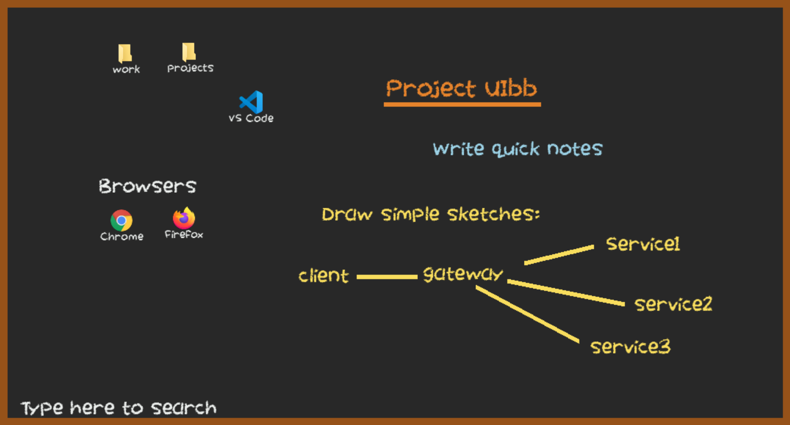

# Project: UIbb

## Description and Preview

A re-imagined desktop environment

## Development

0. Install Python and pip
1. Install dependencies: `pip install -r requirements.txt`
2. Run the app: `python main.py`
